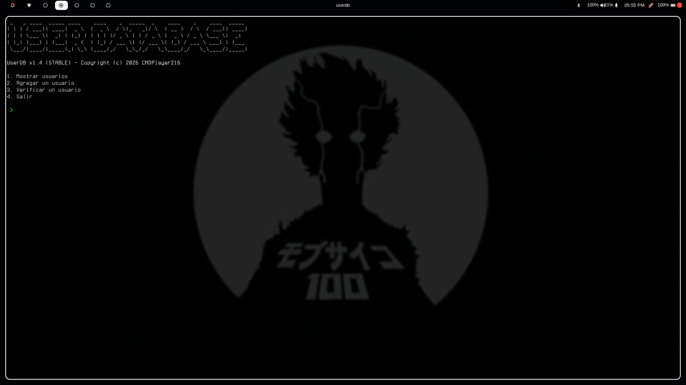
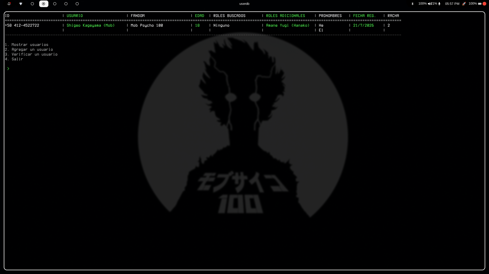
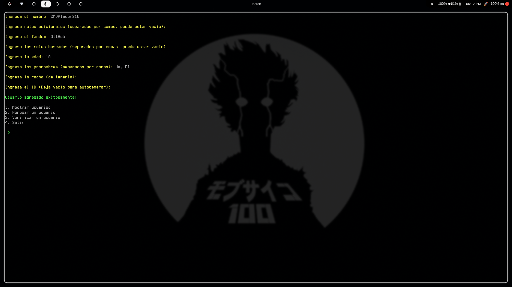
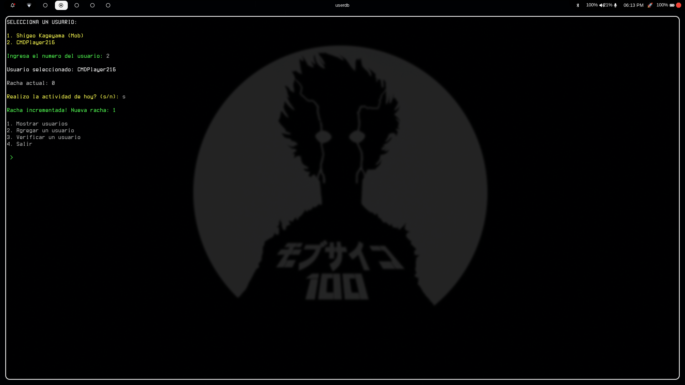

# UserDB v1.4 (STABLE)

**UserDB** es una herramienta de línea de comandos (CLI) desarrollada en C# / .NET para la gestión ligera y estructurada de perfiles de usuario, roles, fandoms y seguimiento de rachas (streaks) diarias. 

El sistema almacena la información localmente mediante ficheros JSON individuales para cada usuario y un índice general `.dat`, ofreciendo una interfaz visual en consola formateada con colores y tablas multilínea.

---

## 📸 Screenshots

| Menú Principal | Vista de Tabla de Usuarios |
| :---: | :---: |
|  |  |

| Registro de Usuario | Verificación de Racha |
| :---: | :---: |
|  |  |

---

## 🚀 Características Principales

- **Tabla Multilínea en Consola**: Renderizado dinamico con ajuste de columnas para arrays de roles buscados, roles adicionales y pronombres.
- **Sistema de Rachas (Streaks)**: Módulo interactivo para verificar la actividad diaria de un usuario e incrementar o reiniciar su contador.
- **Persistencia JSON Local**: Cada perfil se guarda de forma independiente en un archivo `.json` formateado, evitando colisiones de nombres mediante numeración automática.
- **Indexación Rápida**: Mantenimiento de un archivo `users.dat` que actúa como índice central de rutas.
- **Soporte Cross-Platform**: Scripts de compilación automáticos en Bash para generar ejecutable *self-contained* y *single-file* en Linux (`x64`) y Windows (`win-x64`).

---

## 🛠️ Tecnologías Utilizadas

- **Lenguaje**: C# (.NET 8.0+)
- **Librerías**: `System.Text.Json` para serialización
- **Compilación**: Target nativo `linux-x64` y `win-x64` con `PublishSingleFile`

---

## 📂 Estructura de Datos y Almacenamiento

El programa crea automáticamente el directorio de datos en la carpeta personal del usuario (`~/.userdatabase_data/` en Linux / `%USERPROFILE%\.userdatabase_data\` en Windows).

```text
~/.userdatabase_data/
├── users.dat              # Índice general (formato: Nombre,RutaArchivoJSON)
├── Gabriel.json           # Perfil individual en formato JSON
├── Gabriel1.json          # Autonumeración en caso de duplicidad de nombre
└── ...
```

### Ejemplo de esquema JSON (`User.json`)

```json
{
  "name": "Gabriel",
  "userId": "d7a4b12c-9e23-4567-89ab-cdef01234567",
  "aditionalRoles": [
    "Dev",
    "Admin"
  ],
  "age": 18,
  "fandom": "Cyberpunk",
  "lookedCharacters": [
    "V",
    "Johnny Silverhand"
  ],
  "pronauns": [
    "he/him"
  ],
  "dateRegistered": "2026-07-21",
  "streak": 5
}
```

---

## 🔨 Compilación e Instalación

### Prerrequisitos

Tener instalado el SDK de .NET:

```bash
dotnet --version
```

### Compilar para Linux (Single File Binary)

Puedes ejecutar el script de publicación incluido en el repositorio:

```bash
chmod +x export-linux.sh
./export-linux.sh
```

Esto generará el binario ejecutable comprimido en `./publish/`.

Puedes instalar directamente en linux usando: 
```bash
chmod +x install.sh
./install.sh
```

### Compilar para Windows

```bash
chmod +x export_windows.sh
./export-windows.sh
```

Genera el ejecutable `.exe` listo para correr en sistemas Windows x64.

---

## 📖 Modo de Uso

Una vez instalado, ejecuta la herramienta en tu terminal:

```bash
userdb
```

O abre el .exe si estas en Windows

### Opciones del Menú

1. **Mostrar usuarios**: Despliega la tabla ASCII interactiva con todos los usuarios registrados y sus métricas.
2. **Agregar un usuario**: Formulario interactivo en consola con validaciones de tipo y campos obligatorios.
3. **Verificar un usuario**: Selecciona un perfil por su índice y marca si cumplió su actividad del día para subir o reiniciar su racha.
4. **Salir**: Cierra la aplicación.

---

## 📜 Licencia y Créditos

Desarrollado por **CMDPlayer216** (2026).
