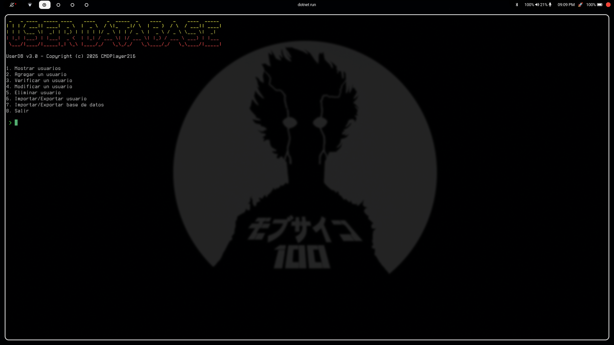
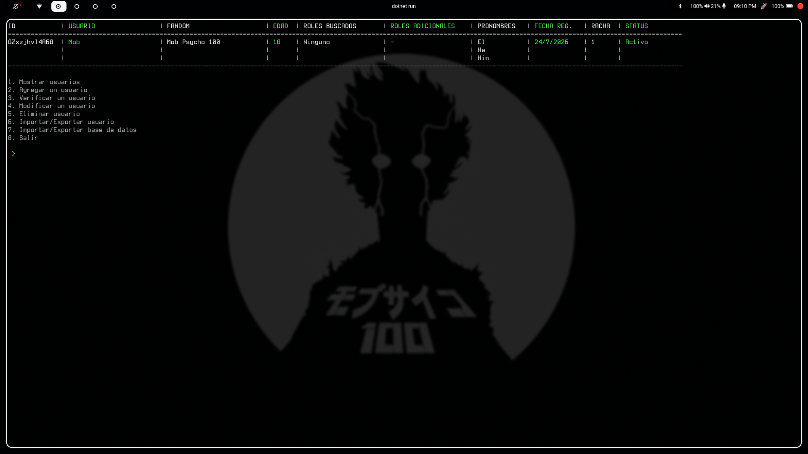
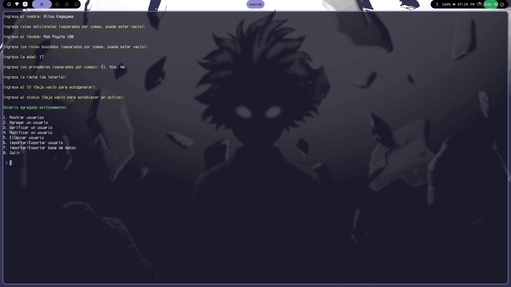
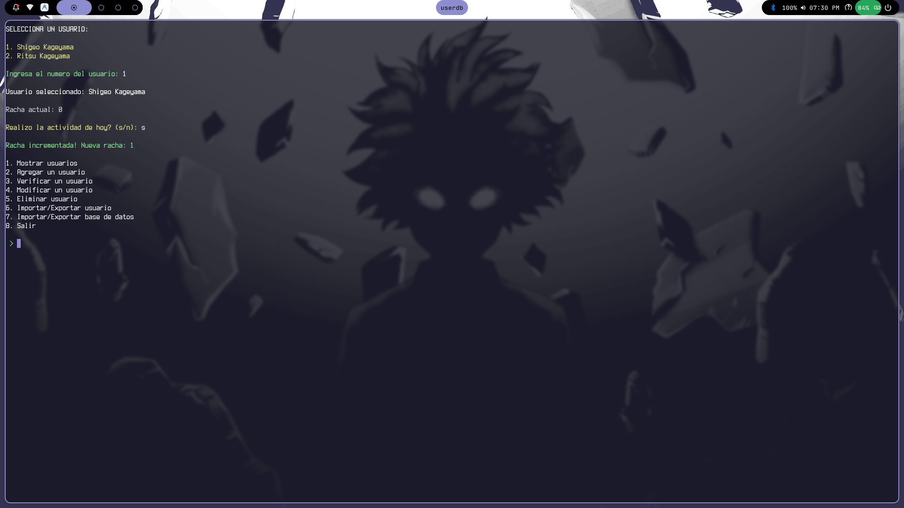

# UserDB v3.1.1

**UserDB** es una herramienta de línea de comandos (CLI) y terminal interactiva desarrollada en C# / .NET para la gestión ligera, rápida y estructurada de perfiles de usuario, roles, fandoms, pronombres, seguimiento de rachas (*streaks*) diarias y operaciones de importación/exportación de bases de datos completas.

Funciona tanto de forma interactiva mediante menús guiados en consola como a través de comandos CLI directos para automatización y scripts. La información se almacena localmente mediante archivos JSON individuales por usuario y un índice central `.dat`, complementado con un sistema de auditoría y logs diarios.

---

## 📸 Screenshots

| Menú Principal | Vista de Tabla de Usuarios |
| :---: | :---: |
|  |  |

| Registro de Usuario | Verificación de Racha |
| :---: | :---: |
|  |  |

---

## 🚀 Características Principales

- **Modo CLI Directo y Modo Interactivo**: Ejecuta el programa sin argumentos para acceder al menú interactivo con navegación guiada o usa subcomandos (`list`, `add`, `modify`, `delete`, `show`, `export`, `import`) con soporte de flags completos.
- **Visualización en Tabla o Texto**: Renderizado dinámico en consola con colores ANSI y columnas adaptativas que formatean colecciones multilínea (roles buscados, roles adicionales, pronombres, etc.) o volcado en formato crudo/JSON.
- **Gestión Completa de Perfiles**:
  - Campos soportados: Nombre, ID (NanoID), Fandom, Edad, Pronombres, Roles Buscados, Roles Adicionales, Status, Fecha de Registro y Racha (*Streak*).
  - Manejo granular de colecciones (añadir/eliminar elementos individualmente o mediante listas separadas por comas).
- **Sistema de Rachas (Streaks)**: Módulo interactivo para validar la actividad diaria de un usuario e incrementar o reiniciar su contador.
- **Importación y Exportación Avanzada**:
  - **Individual**: Exporta e importa perfiles específicos en formato `.json`.
  - **Base de Datos Completa**: Empaqueta y extrae la base de datos completa en archivos comprimidos `.userdb` (ZIP).
  - **Resolución de Conflictos**: 4 modos de importación (`keep`, `overwrite`, `combine-keeping-original`, `combine-keeping-new`).
- **Sistema de Logs Diario**: Auditoría automática de cada operación registrada en archivos `LOG-dd-MM-yyyy.log` separados por fecha (sin hora en el nombre de archivo) para un control diario ordenado.
- **Persistencia JSON e Índice Rápido**: Cada usuario se almacena en `~/.userdb/<userId>.json` sincronizado con un archivo de índice `users.dat` con recuperación y regeneración automática en caso de inconsistencias.
- **Multiplataforma**: Compatible con Linux (`linux-x64`) y Windows (`win-x64`).

---

## 🏗️ Refactorización Arquitectónica

El proyecto fue refactorizado para desacoplar responsabilidades, mejorar la mantenibilidad del código y garantizar la consistencia en el manejo de archivos:

### 1. Desacoplamiento y Estructura Modular
Se dividieron los antiguos archivos monolíticos en módulos con responsabilidades únicas organizados en sus respectivos namespaces:

```text
UserDatabase/
├── Models/                     # [userdb.Models] Modelos de datos y DTOs
│   ├── User.cs                 # Entidad principal de usuario
│   └── ModifyingUser.cs        # DTO para transferir y aplicar modificaciones
│
├── Services/                   # [userdb.Services] Lógica de negocio y persistencia
│   ├── UserService.cs          # Operaciones I/O de usuarios y resolución de rutas
│   ├── RegenerateIndex.cs      # Escaneo de directorio y sincronización de users.dat
│   └── Logs.cs                 # Servicio de logging estructurado diario
│
├── InterfaceServices/          # [userdb.InterfaceServices] Renderizado visual
│   └── ListUsers.cs            # Formateo y renderizado de tablas en consola
│
├── Commands/                   # [userdb.Commands] Lógica pura de comandos
│   ├── AddUser.cs              # Alta de usuarios
│   ├── ModifyUser.cs           # Modificación y renombramiento de archivos
│   ├── DeleteUser.cs           # Eliminación de perfiles
│   ├── Show.cs                 # Consulta individual
│   ├── ListUsers.cs            # Listado (tabla / lista / raw)
│   ├── ExportUser.cs           # Exportación individual a JSON
│   ├── ImportUser.cs           # Importación individual con resolución de conflictos
│   ├── ExportDataBase.cs       # Empaquetado a archivo .userdb
│   └── ImportDataBase.cs       # Descompresión e importación masiva
│
├── Commands/Builders/          # [userdb.Commands.Builders] Configuración CLI (System.CommandLine)
│   ├── AddCommandBuilder.cs
│   ├── ModifyCommandBuilder.cs
│   ├── DeleteCommandBuilder.cs
│   ├── ShowCommandBuilder.cs
│   ├── ListCommandBuilder.cs
│   ├── ExportCommandBuilder.cs
│   └── ImportCommandBuilder.cs
│
├── Menus/                      # [userdb.Menus] Pantallas del modo interactivo
│   ├── AddUser.cs              # AddUserMenu
│   ├── ModifyUser.cs           # ModifyUserMenu
│   ├── ShowUsers.cs            # ShowUsers
│   ├── VerifyUserStreak.cs     # VerifyUserStreak
│   ├── RemoveUser.cs           # RemoveUserMenu
│   ├── UserImportOrExport.cs   # UserImportOrExportMenu
│   └── DataBaseImportOrExport.cs # DataBaseImportOrExportMenu
│
├── ConsoleHelper.cs            # [userdb] Utilidades de consola y colores
└── Program.cs                  # [userdb] Punto de entrada y orquestador principal
```

### 2. Correcciones Clave del Refactor
- **Corrección del Bug al Modificar Usuarios**: Se corrigió el error donde modificar usuarios sin cambiar el ID guardaba el archivo como literal `.json` en lugar de `<userId>.json`.
- **Integridad de Rachas**: Se corrigió la condición de validación de racha en `ModifyUser` y se fijó el valor neutro en `-1` para evitar sobreescribir la racha existente con `0` al omitir el campo.
- **Trazabilidad Total**: Se implementó `Logs.Log` en todas las clases y métodos de la aplicación.

---

## 🛠️ Tecnologías Utilizadas

- **Lenguaje**: C# (.NET 10.0 / 8.0+)
- **Librerías**:
  - `System.CommandLine`: Definición y análisis de comandos CLI.
  - `NanoidDotNet`: Generación de identificadores únicos (NanoID).
  - `System.Text.Json`: Serialización y deserialización estructurada.
  - `System.IO.Compression`: Empaquetado y descompresión de archivos `.userdb`.
- **Compilación**: Ejecutables autocontenidos (*self-contained*) para `linux-x64` y `win-x64`.

---

## 📂 Estructura de Datos y Almacenamiento

### Directorio de Usuarios (`~/.userdb/` en Linux / `%USERPROFILE%\.userdb\` en Windows):
```text
~/.userdb/
├── users.dat              # Índice central (formato: Nombre,RutaArchivoJSON)
├── mob100.json            # Perfil de usuario individual
└── ...
```

### Directorio de Logs (`~/.config/userdb/` en Linux / `%APPDATA%\userdb\` en Windows):
```text
~/.config/userdb/
├── LOG-22-08-2026.log     # Registro diario de actividades
├── LOG-23-08-2026.log
└── ...
```

### Esquema JSON de Usuario (`<userId>.json`)
```json
{
  "name": "Shigeo Kageyama",
  "userId": "mob100",
  "additionalRoles": [
    "Geto"
  ],
  "age": 18,
  "fandom": "Mob Psycho 100",
  "wantedRoles": [
    "Ritsu",
    "Geto"
  ],
  "pronouns": [
    "Él",
    "Him",
    "He"
  ],
  "dateRegistered": "2026-08-17",
  "streak": 0,
  "status": "Activo"
}
```

---

## 🔨 Compilación e Instalación

### Prerrequisitos
Tener instalado el SDK de .NET:
```bash
dotnet --version
```

### Compilar Proyecto
```bash
dotnet build
```

### Exportar Binarios Distribuidos (Linux / Windows)
```bash
chmod +x export.sh
./export.sh
```

---

## 📖 Modo de Uso

### 1. Modo Interactivo
Ejecuta la herramienta sin parámetros para abrir el menú interactivo:

```bash
userdb
```

**Opciones del Menú:**
1. **Mostrar usuarios**: Despliega la tabla formateada con todos los usuarios registrados.
2. **Agregar un usuario**: Asistente interactivo paso a paso con validaciones.
3. **Verificar un usuario**: Revisa y suma/reinicia la racha diaria de un perfil.
4. **Modificar un usuario**: Edita datos personales, añade/elimina roles o pronombres de forma interactiva.
5. **Eliminar usuario**: Selección y eliminación de usuario con confirmación.
6. **Importar/Exportar usuario**: Exporta un perfil a JSON o importa uno con resolución de conflictos.
7. **Importar/Exportar base de datos**: Empaqueta toda la base de datos a `.userdb` o importa una existente.
8. **Salir**: Finaliza el programa.

### 2. Modo de Línea de Comandos (CLI)

#### 🔹 Listar Usuarios (`list`)
```bash
# Mostrar usuarios en formato tabla completa
userdb list --table

# Mostrar contenido en texto plano del índice
userdb list --raw

# Mostrar lista simple de nombres
userdb list
```

#### 🔹 Agregar Usuario (`add`)
```bash
userdb add -n "Reigen Arataka" -f "Mob Psycho 100" -A 28 -p "Él,He" -a "Director,Exorcista" -l "Mob" -s 0 -u "reigen" -S "Activo"
```
*Parámetros:*
- `-n, --name` (Requerido): Nombre del usuario.
- `-f, --fandom` (Requerido): Fandom al que pertenece.
- `-A, --age` (Requerido): Edad del usuario.
- `-p, --pronouns` (Requerido): Pronombres (separados por comas).
- `-a, --additional-roles`: Roles adicionales (separados por comas).
- `-l, --looked-characters`: Personajes/roles buscados (separados por comas).
- `-s, --streak`: Racha inicial (por defecto `0`).
- `-u, --user-id`: ID personalizado (si se omite, se genera un NanoID automático).
- `-S, --status`: Estado del usuario (por defecto `"Activo"`).

#### 🔹 Modificar Usuario (`modify`)
```bash
# Modificar el nombre y agregar roles buscados
userdb modify -u "reigen" -n "Arataka Reigen" -w "Dimple"

# Modificar edad, estado y cambiar el ID del usuario (renombra el archivo automáticamente)
userdb modify -u "reigen" -A 29 -S "Ocupado" -U "reigen-master"
```
*Parámetros:*
- `-u, --source-user` (Requerido): ID del usuario a modificar.
- `-n, --name`: Nuevo nombre.
- `-f, --fandom`: Nuevo fandom.
- `-A, --age`: Nueva edad.
- `-s, --streak`: Nueva racha (`-1` conserva la actual).
- `-U, --user-id`: Nuevo ID (mueve y renombra el archivo `.json`).
- `-S, --status`: Nuevo estado.
- `-a, --add-additional-roles` / `-r, --remove-additional-roles`: Añadir / eliminar roles adicionales.
- `-w, --add-wanted-roles` / `-W, --remove-wanted-roles`: Añadir / eliminar roles buscados.
- `-p, --add-pronouns` / `-P, --remove-pronouns`: Añadir / eliminar pronombres.

#### 🔹 Ver Usuario (`show`)
```bash
# Mostrar datos formateados
userdb show -u "mob100"

# Mostrar JSON en crudo
userdb show -u "mob100" --raw
```

#### 🔹 Eliminar Usuario (`delete`)
```bash
# Eliminar solicitando confirmación
userdb delete -u "reigen"

# Eliminar omitiendo confirmación
userdb delete -u "reigen" --no-confirm
```

#### 🔹 Exportar (`export`)
```bash
# Exportar toda la base de datos a un archivo .userdb
userdb export -a -t "copia_seguridad.userdb"

# Exportar un usuario específico a un archivo .json
userdb export -u "mob100" -t "mob_backup.json"
```

#### 🔹 Importar (`import`)
```bash
# Importar una base de datos completa conservando usuarios existentes si hay duplicados
userdb import -a -t "copia_seguridad.userdb" -m "keep"

# Importar un usuario sobrescribiendo datos existentes
userdb import -t "nuevo_usuario.json" -m "overwrite"
```
*Modos soportados (`-m, --mode`):*
- `keep`: Conserva el usuario local existente si hay coincidencia de ID.
- `overwrite`: Sobrescribe completamente el usuario local.
- `combine-keeping-original`: Combina listas agregando elementos nuevos, conservando valores originales en campos individuales.
- `combine-keeping-new`: Combina listas y actualiza los campos individuales con los valores nuevos.

---

## 📜 Licencia y Créditos

Desarrollado por **CMDPlayer216** (2026).
